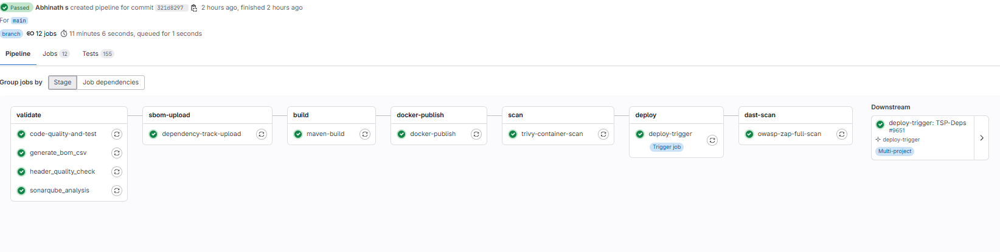
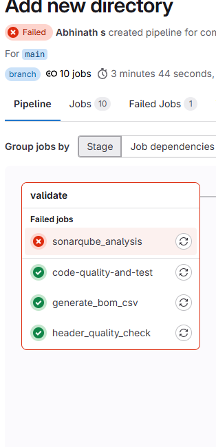
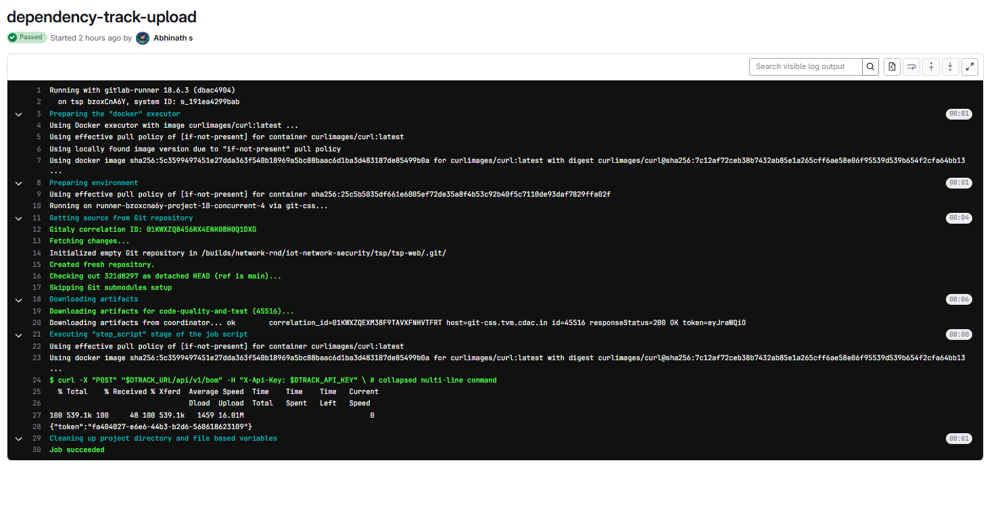
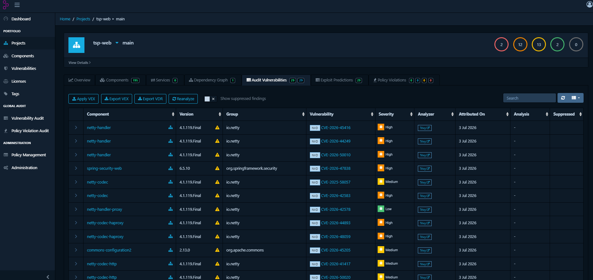
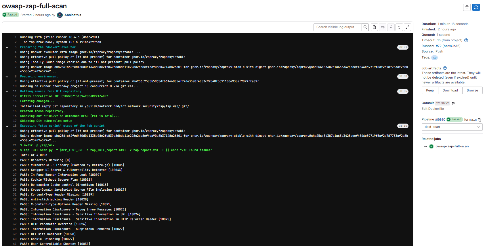
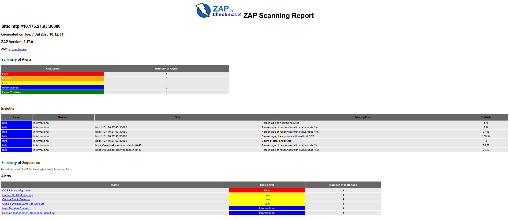
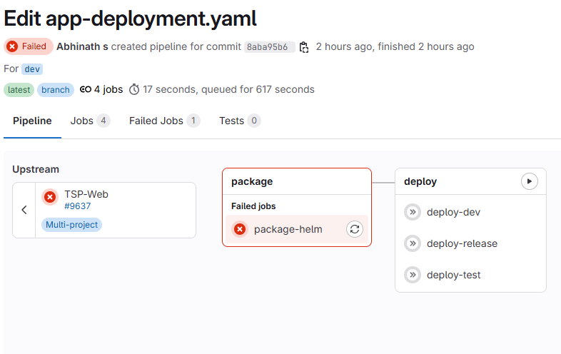

# Pipeline Gate Validation — Success and Failure Test Cases

Evidence for Table VIII, referenced in Section [Results/Evaluation] of the paper *"An Open DevOps Automation System for Continuous Secure Software Delivery"* (IC3 2026).

Project: `tsp-web` (main branch) / `tsp-deps` (dev branch), self-hosted GitLab (`git-css.tvm.cdac.in`), GitLab Runner 18.6.3.

## Table VIII — Pipeline Gate Test Cases

| # | Test Case | Input / Trigger | Gate | Observed Behavior | Result |
|---|---|---|---|---|---|
| 1 | Success — clean build | Commit `321d8297` to `main`, no quality/vuln issues | All stages | validate → sbom-upload → build → docker-publish → scan → deploy → dast-scan all passed; downstream `deploy-trigger: TSP-Deps #9651` fired | Pass |
| 2 | Failure — SAST violation | Commit to `main` breaching SonarQube quality gate | `sonarqube_analysis` | Job failed within validate stage; `code-quality-and-test`, `generate_bom_csv`, `header_quality_check` passed independently | Blocked as expected |
| 3 | Vulnerable dependency detection | SBOM uploaded to Dependency-Track on every build | `dependency-track-upload` → Dependency-Track analysis | Upload job passed (HTTP 200); Dependency-Track audit subsequently identified 29 vulnerabilities across `tsp-web` components (2 Critical, 12 High, 13 Medium, 2 Low), incl. `netty-handler` CVE-2026-45416 (High) and `spring-security-web` CVE-2026-47838 (High) | Detection confirmed |
| 4 | DAST finding | `owasp-zap-full-scan` run against deployed build (commit `321d8297`) | `owasp-zap-full-scan` | Job passed (scan completed, 1m18s); generated ZAP report flagged 1 High-risk alert (CORS Misconfiguration, 4 instances), 3 Low, 2 Informational | Detection confirmed |
| 5 | Failure — deployment misconfiguration | Commit `8aba95b6` to `dev`, upstream trigger from TSP-Web #9637 | `package-helm` | `package-helm` job failed in package stage; downstream `deploy-dev`, `deploy-release`, `deploy-test` jobs did not execute | Blocked as expected |

**Note on Test Cases 3 and 4:** these validate detection rather than hard pipeline blocking — findings are surfaced in Dependency-Track and the ZAP report for review/triage rather than auto-failing the build, consistent with the project's current gate configuration (severity-threshold enforcement can be added as a follow-on).

---

## Evidence

### Test Case 1 — Success (clean build, all stages passed)

### Test Case 2 — SAST violation (sonarqube_analysis failed)

### Test Case 3 — SBOM upload and vulnerability detection

### Test Case 4 — DAST scan and finding

### Test Case 5 — Deployment misconfiguration (package-helm failed, deploy blocked)

---

*Data collected 3–7 July 2026 from live CDAC-TVM self-hosted infrastructure (GitLab CI/CD, SonarQube, Dependency-Track, OWASP ZAP).*
